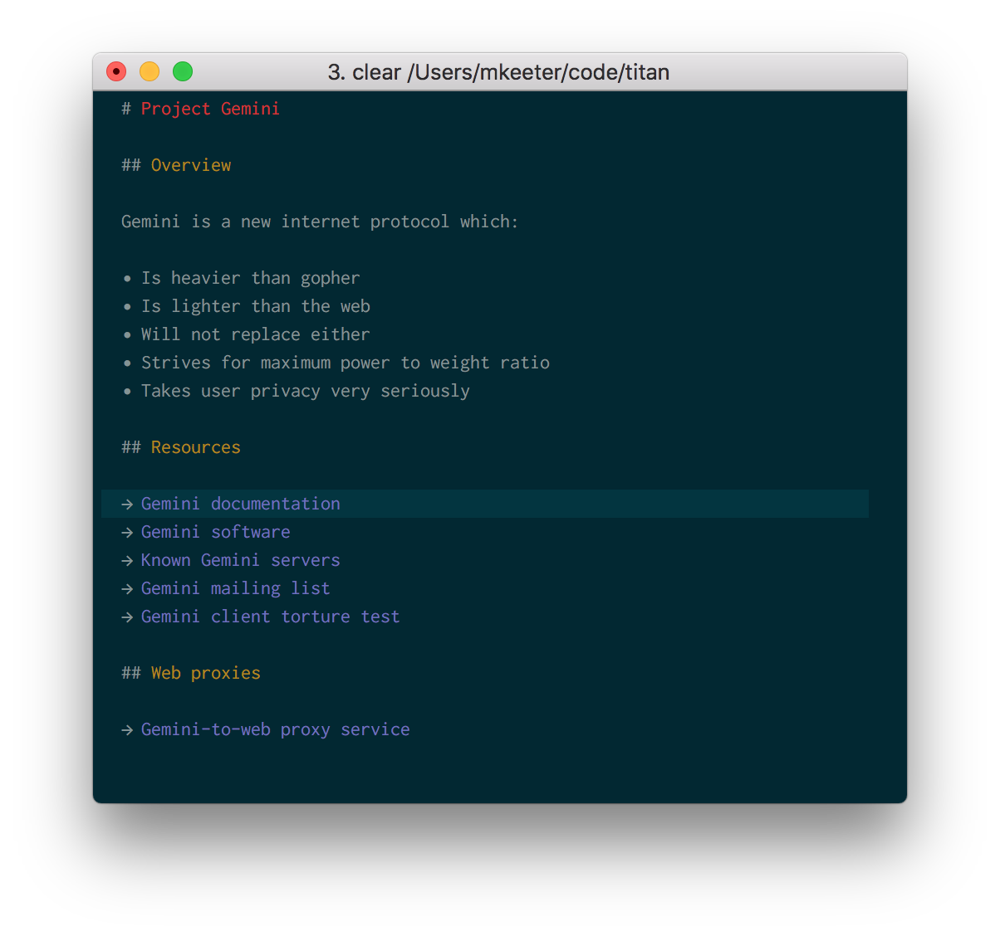

# Titan

Titan is a half-finished terminal-based browser for the [Gemini protocol](https://gemini.circumlunar.space/).

It takes inspiration from Vim, and is written in Rust.

## What works?
- A zero-copy parser for the Gemini header and `text/gemini` format
- Terminal-based browsing
- Trust-on-first-use certificate system

## What doesn't work?
- Good error handling: in most cases, it will exit on any error
- TLS v1 certificate handling (uncommon, but seen in the wild on sites hosted with [`gmnisrv`](https://git.sr.ht/~sircmpwn/gmnisrv))
